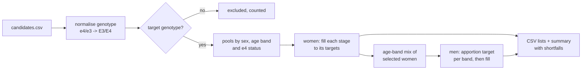

# Clinical Cohort Selector

[](https://github.com/dsugurtuna/clinical-cohort-selector/actions/workflows/ci.yml)

Build genotype-balanced, age-matched recall lists from a genotyped participant pool, and see what each exclusion costs before you commit to it.

> **Portfolio disclaimer:** This repository contains sanitised, generalised versions of tooling developed at NIHR BioResource. No real participant data or internal paths are included.

## The problem

A recall study often needs fixed numbers of APOE e4 carriers and e3/e3 controls in each age group, plus a comparison group of men matched on age. Doing that by hand in spreadsheets is slow and hard to check, and a late change to the criteria (for example, excluding e2 carriers) can quietly leave some groups short.

## What this does

- **Stratifies women by life stage.** Age bands are grouped into stages (default: pre 35-44, peri 45-49, early 50-54, late 55-69) and each stage gets a target number of e4 carriers (e3/e4, e4/e4) and e3/e3 controls.
- **Age-matches men to the women actually selected.** The male target is a share of the female total, split evenly between e4 carriers and e3/e3, and spread across age bands in the same proportions as the selected women.
- **Handles e2 explicitly.** By default e2/e4 is excluded; with `--no-exclude-e2` it counts as an e4 carrier. e2/e2 and e2/e3 are never targets.
- **Shows shortfalls.** Each group reports selected versus target, so an under-filled stage is visible rather than silent.
- **Measures an exclusion's impact** before it is applied: how many people, which sexes, which genotypes remain.
- **Joins genotypes to age and sex** from two differently formatted files and reports what did not match.

## Quickstart

Runs on the synthetic data in `examples/` (800 invented participants).

```bash
git clone https://github.com/dsugurtuna/clinical-cohort-selector.git
cd clinical-cohort-selector
python3.11 -m venv .venv && source .venv/bin/activate
pip install -e ".[dev]"
pytest

python -m cohort_selector impact examples/candidates.csv --pattern E2
python -m cohort_selector stratify examples/candidates.csv \
  --e4-per-stage 20 --e3e3-per-stage 20 --seed 1 --out recall/
python -m cohort_selector merge examples/genotypes.csv examples/phenotypes.txt master.csv
```

`stratify` prints a summary such as `peri: 27 (e4 carriers 7/20, e3/e3 20/20, shortfall 13)`: the synthetic pool has too few e4 carriers aged 45-49 to fill that stage.

From Python:

```python
from cohort_selector import CohortStratifier

stratifier = CohortStratifier(exclude_e2=True)
result = stratifier.build_recall(
    "examples/candidates.csv", e4_per_stage=20, e3e3_per_stage=20, seed=1
)
for name, stage in result.female_stages.items():
    print(name, stage.total, "shortfall", stage.shortfall)
```

## How it works



Input columns: `participant_id, genotype, gender, age_band` (for `merge`: `sample_id,participant_id,genotype` and `sample_id age gender`).

## Design decisions

- **Age-matching follows the women who were selected, not the whole pool.** If a stage runs short, the men should mirror the study group that exists, not the one that was planned.
- **Largest-remainder apportioning.** Rounding each band separately can over- or under-shoot the male total; this method always hits it exactly and breaks ties by band name, so reruns agree.
- **Deterministic selection.** Without `--seed` candidates are taken in file order; with a seed they are drawn in a reproducible random order. Either way the same inputs give the same list, which matters when a list has to be re-issued or audited. A seed avoids the bias of taking whoever happens to be first in the file.
- **Genotypes are normalised before matching.** `e4/e3`, `E3E4` and `E3/E4` are the same genotype; string equality alone would drop some people.
- **Shortfalls are data, not warnings.** They are stored on each allocation and written to the summary so they survive into whatever reads the output.
- **No third-party dependencies.** The package uses the standard library only, which keeps it easy to run inside a restricted analysis environment.

## Limitations and what it is not

- Life stage is inferred from age band only. There is no hormonal or clinical menopausal staging.
- It selects; it does not recruit or consent. Who may be contacted, and how, is decided elsewhere.
- Matching is on age band and e4 status only, not on other covariates such as ancestry or recruitment site.
- The impact analyser matches a substring of the genotype (`E2` finds e2/e3, e2/e4 and e2/e2); it is a quick check, not a rules engine.
- The scripts in `legacy/` are kept as originally published for reference. They are not maintained, not linted, and create placeholder input files when real ones are missing.

## Where this fits

Uses APOE genotypes from [apoe-genotyping-toolkit](https://github.com/dsugurtuna/apoe-genotyping-toolkit). Related: [recall-study-generator](https://github.com/dsugurtuna/recall-study-generator) and [snp-feasibility-checker](https://github.com/dsugurtuna/snp-feasibility-checker).

## Roadmap

- Match men on exact age within a band, not just band counts.
- Read stage definitions and targets from a small config file kept with the output.
- Write a machine-readable manifest (inputs, seed, targets, shortfalls) next to the lists.

## Jira Provenance

- **Recall-study design** — stratified recall lists with 50/50 e4 carrier split across biological stages (NBR267-style, 816-participant design).
- **Exclusion impact analysis** — quantifying the cost of introducing e2-carrier exclusion before finalising the protocol.
- **Data integration** — joining APOE genotype calls with clinical phenotype data (age, gender) from disparate sources.

## Licence

MIT is declared in `pyproject.toml`, but no licence file is included yet.

---

Personal project by [Ugur Tuna](https://github.com/dsugurtuna). Not affiliated with or endorsed by any employer.
